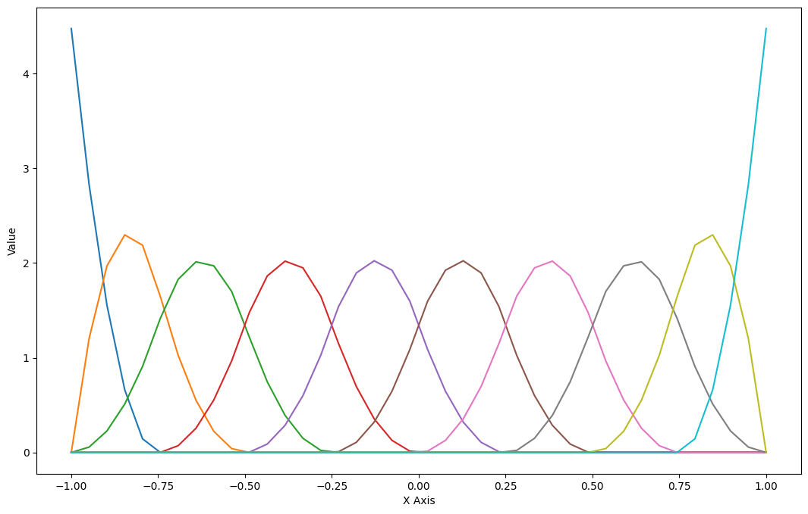
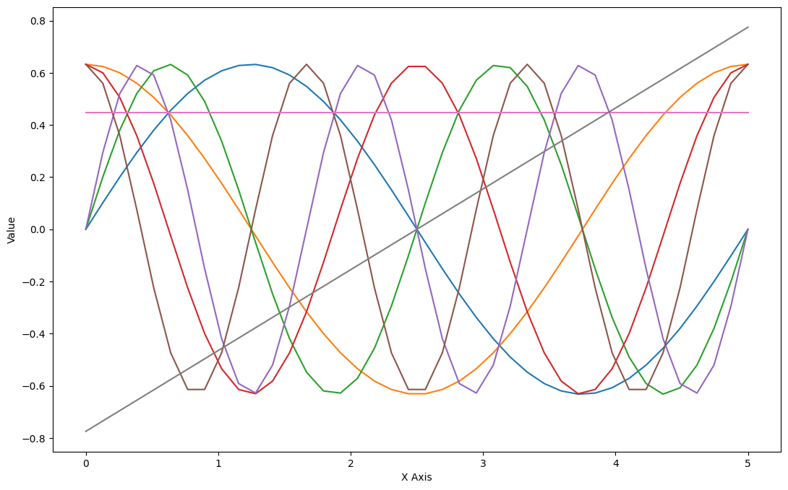
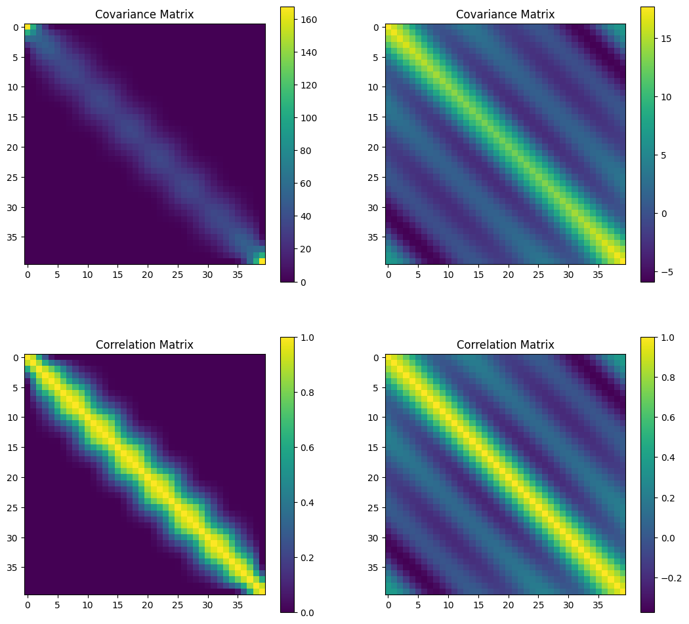
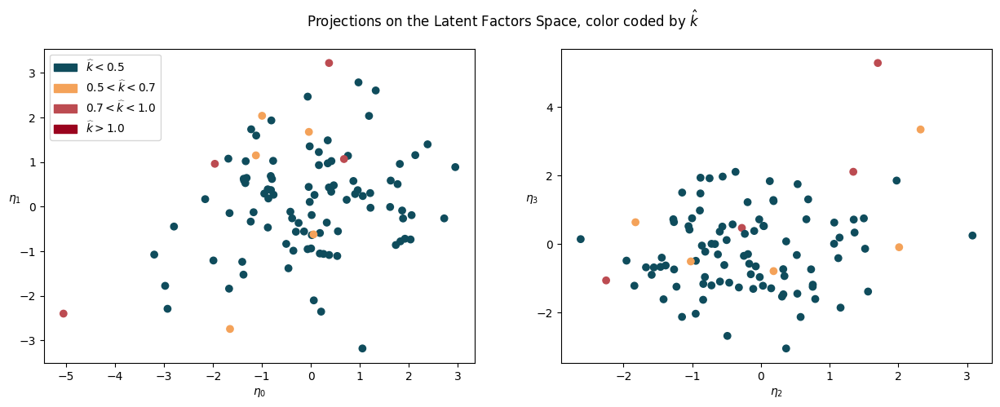
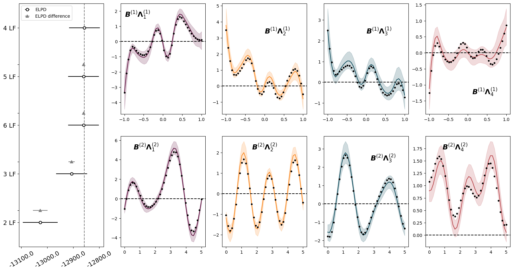
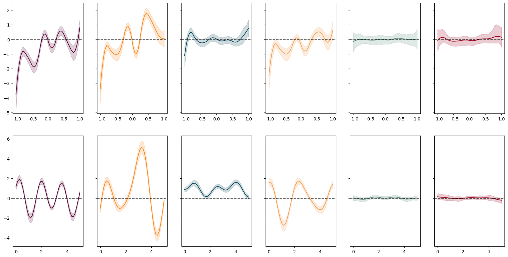
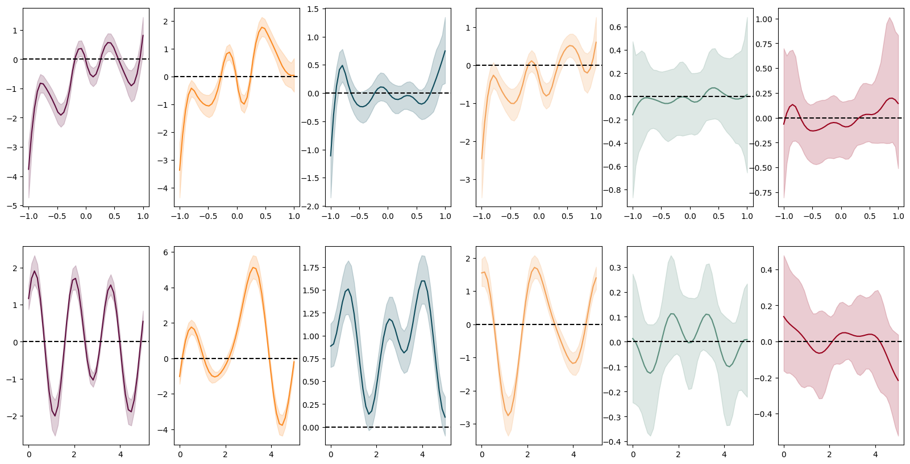
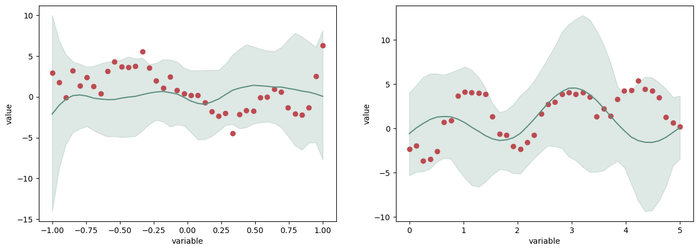
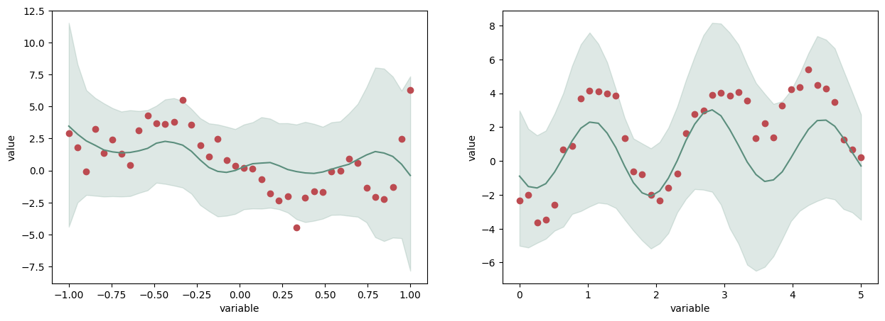
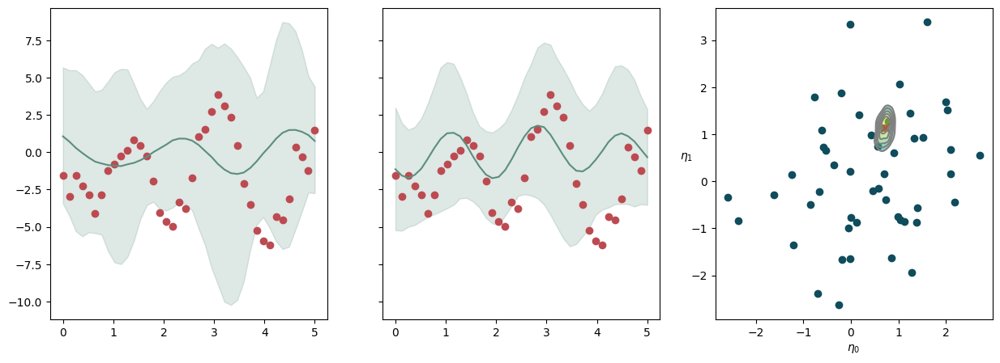

# Boilerplate


```python
import bayesian_multitarget_latent_factors as bmlf
import numpy as np
import matplotlib.pyplot as plt
import arviz as az
import xarray as xr

rng = np.random.default_rng(999)
```


```python
def plot_all_B_dict(B_dict, ax = None):
    if ax is None:
        fig, ax = plt.subplots(1,1,figsize=(13,8))
    else:
        fig = ax.get_figure()
    for i in range(B_dict['p']):
        bmlf.plot_col_basis_dict(B_dict, col_idx=i, ax=ax)
    ax.get_legend().set_visible(False)
    ax.set_title('')
    return fig, ax
```

# Prior and Dataset Generation

## Basis Matrix Build


```python
B1 = bmlf.make_basis_dict_structured(
    basis_type='bspline',
    dimensionality=1,
    p=3,
    n_basis=10,
    domain_range=(-1, 1),
    num_points=40,
    add_optional_terms='no',
)
plot_all_B_dict(B1)
```


    (<Figure size 1300x800 with 1 Axes>, <Axes: xlabel='X Axis', ylabel='Value'>)


    

    


```python
B2 = bmlf.make_basis_dict_structured(
    basis_type='fourier',
    dimensionality=1,
    n_basis=6,
    domain_range=(0, 5),
    grid_spacing=None,
    num_points=40,
    add_optional_terms='linear',
)
plot_all_B_dict(B2)
```


    (<Figure size 1300x800 with 1 Axes>, <Axes: xlabel='X Axis', ylabel='Value'>)


    

    


## Hyperparameters and Data Generation


```python
N_train = 100
N_test = 50

hyperparams_dict = \
bmlf.initialize_hyperparams_dict(
    k=4,
    v=4,
    nu=4,
    ψ_alpha=5,
    ψ_beta=4,
    ψ_sigma_1=1.0,
    ψ_sigma_2=1.0,
    θ_alpha=5,
    θ_beta=4,
    θ_sigma_1=1.0,
    θ_sigma_2=1.0,
    alpha_1=2.1,
    alpha_2=2.5,
)

generator_dict = bmlf.make_prior_dict(
    hyperparams_dict,
    B1,
    B2,
    N = N_train + N_test,
    r = 5
)
```


```python
generator_dict['X'] = rng.normal(scale = 0.3, size=generator_dict['X'].shape)

generator_sample_ds = \
bmlf.sample_from_prior(
    data_dic = generator_dict,
    X_test = np.zeros((generator_dict['r'],1)),
    n_samples = 5,
    rng_seed = rng.integers(1000000),
)
```


```python
prior_dict = bmlf.make_prior_dict(
    hyperparams_dict,
    B1,
    B2,
    y1 = generator_sample_ds.sel(sample=0)['y1_predictive'].values[:,:N_train],
    y2 = generator_sample_ds.sel(sample=0)['y2_predictive'].values[:,:N_train],
    X = generator_dict['X'][:,:N_train]
)
```


```python
test_set_dic = {
    'y1' : generator_sample_ds.sel(sample=0)['y1_predictive'].values[:,N_train:],
    'y2' : generator_sample_ds.sel(sample=0)['y2_predictive'].values[:,N_train:],
    'X' : generator_dict['X'][:,N_train:]
}
```

## Prior Predictive Statistics


```python
bmlf.prior_predictive_properties_from_prior_dict(prior_dict)
```


$$\mathbb{E}\left[\left(\tau_{\lambda 1}^{(i)}\right)^{-1}\right]=\frac{1}{\alpha_1-1} \approx 0.91$$


$$\mathbb{E}\left[\left(\tau_{\lambda k}^{(i)}\right)^{-1}\right]=\frac{1}{\alpha_1-1}\left(\frac{1}{\alpha_2-1}\right)^{k-1} \approx 0.27$$


$$\operatorname{\mathbb{V}ar}\left[\left(\frac{\tau_{\lambda k}^{(i)}}{\tau_{\lambda 1}^{(i)}}\right)^{-1}\right]=\left[\frac{1}{\left(\alpha_2-1\right)\left(\alpha_2-2\right)}\right]^{k-1} \cdot\left[1-\left(\frac{\alpha_2-2}{\alpha_2-1}\right)^{k-1}\right] \approx 2.28$$


$$\operatorname{Var}\left[\left(\tau_{\lambda k}^{(i)}\right)^{-1}\right]=\frac{1}{\left(\alpha_1-1\right)\left(\alpha_1-2\right)}\left[\frac{1}{\left(\alpha_2-1\right)\left(\alpha_2-2\right)}\right]^{k-1} \cdot\left[1-\frac{\alpha_1-2}{\alpha_1-1}\left(\frac{\alpha_2-2}{\alpha_2-1}\right)^{k-1}\right] \approx 21.48$$


$${\sigma^2_{\mathcal{W}\mathcal{N}}}^{(1)} = \frac{L_1\beta_\psi^{(1)}}{\alpha_\psi-1} \approx 40.00, \qquad {\sigma^2_{\mathcal{W}\mathcal{N}}}^{(2)} = \frac{L_2 \beta_\psi^{(2)}}{\alpha_\psi-1} \approx 40.00, \qquad \sigma^2_{\mathcal{W}\mathcal{N}} = {\sigma^2_{\mathcal{W}\mathcal{N}}}^{(1)} + {\sigma^2_{\mathcal{W}\mathcal{N}}}^{(2)} \approx 80.00$$


$$\textbf{Tr}\left( B^{(1)}{B^{(1)}}^T \right) \approx217.70, \qquad \textbf{Tr}\left( B^{(2)}{B^{(2)}}^T \right) \approx64.41, \qquad\textbf{Tr}\left( B B^T \right) \approx282.11$$


$${\sigma^2_{\mathcal{W}\mathcal{N}}}^{(1)}/L_1 = \frac{\beta_\psi^{(1)}}{\alpha_\psi-1} \approx 1.00, \qquad \frac{{\sigma^2_{\mathcal{W}\mathcal{N}}}^{(2)}}{L_2} = \frac{\beta_\psi^{(2)}}{\alpha_\psi-1} \approx 1.00, \qquad \sigma^2_{\mathcal{W}\mathcal{N}}/(L_1 + L_2) = \frac{{\sigma^2_{\mathcal{W}\mathcal{N}}}^{(1)} + {\sigma^2_{\mathcal{W}\mathcal{N}}}^{(2)}}{L_1 + L_2} \approx 1.00$$


$$\frac{\textbf{Tr}\left( B^{(1)}{B^{(1)}}^T \right)}{L_1} \approx5.44, \qquad \frac{\textbf{Tr}\left( B^{(2)}{B^{(2)}}^T \right)}{L_2} \approx1.61, \qquad\frac{\textbf{Tr}\left( B B^T \right)}{L_1+L_2} \approx3.53$$


$$\rho_{\Lambda}^{(k)}=\Sigma_{T \Lambda}^k / \Sigma_{T \Lambda}^{\infty}=1-\left(\frac{1}{\alpha_2-1}\right)^k \approx 0.80$$


$$\sigma_{\Lambda}^2=\frac{\nu}{\nu-2} \frac{1}{\alpha_1-1} \frac{\alpha_2-1}{\alpha_2-2} \approx 5.45$$


$$\sigma^2_{\mathcal{I}} = \frac{\beta_\sigma}{\alpha_\sigma - 1}1.00$$


$$\left.\Sigma_{T \Lambda, s}^k\right|_{X=0}=\rho_{\Lambda}^{(k)}\sigma_{\Lambda}^2 \operatorname{Tr}\left(\boldsymbol{B} \boldsymbol{B}^T\right) \approx 1234.82$$


$$\Sigma_{T \Lambda, s}^k=\rho_{\Lambda}^{(k)} \operatorname{Tr}\left(\boldsymbol{B} \boldsymbol{B}^T\right)\left[\sigma_{\Lambda}^2\left(1+\frac{\chi}{\chi-2}\left\|\boldsymbol{X}_{\cdot, s}\right\|_2^2\right)\right] \approx 2355.14$$


$$\frac{\left.\Sigma_{T \Lambda, s}^k\right|_{X=0}}{L_1+L_2} \approx15.44$$


$$\frac{\Sigma_{T \Lambda, s}^k}{L_1+L_2} \approx29.44$$


$$\operatorname{Tr}\left(\boldsymbol{B} \boldsymbol{B}^T\right)\left[\sigma_{\mathcal{I}}^2+\rho_{\Lambda}^{(k)} \sigma_{\Lambda}^2\right] \approx 1516.93$$


$$\operatorname{Tr}\left(\boldsymbol{B} \boldsymbol{B}^T\right)\left[\sigma_{\mathcal{I}}^2+\rho_{\Lambda}^{(k)} \sigma_{\Lambda}^2\left(1+\frac{\chi}{\chi-2}\left\|\boldsymbol{X}_{,, s}\right\|_2^2\right)\right] \approx 2637.24$$


$$\frac{\operatorname{Tr}\left(\boldsymbol{B} \boldsymbol{B}^T\right)}{L_1+L_2}\left[\sigma_{\mathcal{I}}^2+\rho_{\Lambda}^{(k)} \sigma_{\Lambda}^2\right] \approx 18.96$$


$$\frac{\operatorname{Tr}\left(\boldsymbol{B} \boldsymbol{B}^T\right)}{L_1+L_2}\left[\sigma_{\mathcal{I}}^2+\rho_{\Lambda}^{(k)} \sigma_{\Lambda}^2\left(1+\frac{\chi}{\chi-2}\left\|\boldsymbol{X}_{,, s}\right\|_2^2\right)\right] \approx 32.97$$


    

    


# Posterior Sampling


```python
out_dir = './SIS2024_posterior'
```


```python
from os.path import isfile

if not isfile(out_dir + '/idata.nc'):
    idata = \
    bmlf.sample_from_posterior_moore_penrose_trick(
        prior_dict,
        rng.integers(1000000),
        stan_file_path=None,
        output_dir=out_dir,
        laplace_draws=100,
        iter_warmup=500,
        iter_sampling=1000,
        do_prior_sampling=False,
        max_treedepth=12,
        X_test=None,
    )
    idata.to_netcdf(out_dir + '/idata.nc')

    prior_dict['k'] = 2
    idata2 = \
    bmlf.sample_from_posterior_moore_penrose_trick(
        prior_dict,
        rng.integers(1000000),
        stan_file_path=None,
        output_dir=out_dir+'/2',
        laplace_draws=100,
        iter_warmup=500,
        iter_sampling=1000,
        do_prior_sampling=False,
        max_treedepth=12,
        X_test=None,
    )
    idata2.to_netcdf(out_dir + '/2/idata2.nc')
    
    prior_dict['k'] = 3
    idata3 = \
    bmlf.sample_from_posterior_moore_penrose_trick(
        prior_dict,
        rng.integers(1000000),
        stan_file_path=None,
        output_dir=out_dir+'/3',
        laplace_draws=100,
        iter_warmup=500,
        iter_sampling=1000,
        do_prior_sampling=False,
        max_treedepth=12,
        X_test=None,
    )
    idata3.to_netcdf(out_dir + '/3/idata3.nc')
    
    prior_dict['k'] = 5
    idata5 = \
    bmlf.sample_from_posterior_moore_penrose_trick(
        prior_dict,
        rng.integers(1000000),
        stan_file_path=None,
        output_dir=out_dir+'/5',
        laplace_draws=100,
        iter_warmup=500,
        iter_sampling=1000,
        do_prior_sampling=False,
        max_treedepth=12,
        X_test=None,
    )
    idata5.to_netcdf(out_dir + '/5/idata5.nc')
    
    prior_dict['k'] = 6
    idata6 = \
    bmlf.sample_from_posterior_moore_penrose_trick(
        prior_dict,
        rng.integers(1000000),
        stan_file_path=None,
        output_dir=out_dir+'/6',
        laplace_draws=100,
        iter_warmup=500,
        iter_sampling=1000,
        do_prior_sampling=False,
        max_treedepth=12,
        X_test=None,
    )
    idata6.to_netcdf(out_dir + '/6/idata6.nc')
    
else:
    idata = az.from_netcdf(out_dir + '/idata.nc')
    idata2 = az.from_netcdf(out_dir + '/2/idata2.nc')
    idata3 = az.from_netcdf(out_dir + '/3/idata3.nc')
    idata5 = az.from_netcdf(out_dir + '/5/idata5.nc')
    idata6 = az.from_netcdf(out_dir + '/6/idata6.nc')
    
```

    18:25:32 - cmdstanpy - INFO - Chain [1] start processing


    While deleting output_dir
    [Errno 2] No such file or directory: './SIS2024_posterior'


    18:25:32 - cmdstanpy - INFO - Chain [1] done processing
    18:25:32 - cmdstanpy - INFO - Chain [1] start processing
    18:25:33 - cmdstanpy - INFO - Chain [1] done processing
    18:25:33 - cmdstanpy - INFO - Chain [1] start processing
    18:25:33 - cmdstanpy - INFO - Chain [1] done processing
    18:25:33 - cmdstanpy - INFO - Chain [1] start processing
    18:25:34 - cmdstanpy - INFO - Chain [1] done processing
    18:25:34 - cmdstanpy - INFO - Chain [1] start processing
    18:25:34 - cmdstanpy - INFO - Chain [1] done processing
    18:25:34 - cmdstanpy - INFO - Chain [1] start processing
    18:25:34 - cmdstanpy - INFO - Chain [1] done processing
    18:25:34 - cmdstanpy - INFO - Chain [1] start processing
    18:25:35 - cmdstanpy - INFO - Chain [1] done processing
    18:25:35 - cmdstanpy - INFO - Chain [1] start processing
    18:25:35 - cmdstanpy - INFO - Chain [1] done processing
    18:25:35 - cmdstanpy - INFO - Chain [1] start processing
    18:25:36 - cmdstanpy - INFO - Chain [1] done processing
    18:25:36 - cmdstanpy - INFO - Chain [1] start processing
    18:25:36 - cmdstanpy - INFO - Chain [1] done processing
    18:25:36 - cmdstanpy - INFO - Chain [1] start processing
    18:25:36 - cmdstanpy - INFO - Chain [1] done processing
    18:25:36 - cmdstanpy - INFO - Chain [1] start processing
    18:25:37 - cmdstanpy - INFO - Chain [1] done processing
    18:25:37 - cmdstanpy - INFO - Chain [1] start processing
    18:25:37 - cmdstanpy - INFO - Chain [1] done processing
    18:25:37 - cmdstanpy - INFO - Chain [1] start processing
    18:25:38 - cmdstanpy - INFO - Chain [1] done processing
    18:25:38 - cmdstanpy - INFO - Chain [1] start processing
    18:25:38 - cmdstanpy - INFO - Chain [1] done processing
    18:25:38 - cmdstanpy - INFO - Chain [1] start processing
    18:25:38 - cmdstanpy - INFO - Chain [1] done processing
    18:25:38 - cmdstanpy - INFO - Chain [1] start processing
    18:25:39 - cmdstanpy - INFO - Chain [1] done processing
    18:25:39 - cmdstanpy - INFO - Chain [1] start processing
    18:25:39 - cmdstanpy - INFO - Chain [1] done processing
    18:25:39 - cmdstanpy - INFO - Chain [1] start processing
    18:25:39 - cmdstanpy - INFO - Chain [1] done processing
    18:25:39 - cmdstanpy - INFO - Chain [1] start processing
    18:25:40 - cmdstanpy - INFO - Chain [1] done processing
    18:25:40 - cmdstanpy - INFO - Chain [1] start processing
    18:25:40 - cmdstanpy - INFO - Chain [1] done processing
    18:25:40 - cmdstanpy - INFO - Chain [1] start processing
    18:25:41 - cmdstanpy - INFO - Chain [1] done processing
    18:25:41 - cmdstanpy - INFO - Chain [1] start processing
    18:25:41 - cmdstanpy - INFO - Chain [1] done processing
    18:25:41 - cmdstanpy - INFO - Chain [1] start processing
    18:25:41 - cmdstanpy - INFO - Chain [1] done processing
    18:25:42 - cmdstanpy - INFO - Chain [1] start processing
    18:25:42 - cmdstanpy - INFO - Chain [1] done processing
    18:25:42 - cmdstanpy - INFO - Chain [1] start processing
    18:25:42 - cmdstanpy - INFO - Chain [1] done processing
    18:25:42 - cmdstanpy - INFO - Chain [1] start processing
    18:25:43 - cmdstanpy - INFO - Chain [1] done processing
    18:25:43 - cmdstanpy - INFO - Chain [1] start processing
    18:25:43 - cmdstanpy - INFO - Chain [1] done processing
    18:25:43 - cmdstanpy - INFO - Chain [1] start processing
    18:25:43 - cmdstanpy - INFO - Chain [1] done processing
    18:25:43 - cmdstanpy - INFO - Chain [1] start processing
    18:25:44 - cmdstanpy - INFO - Chain [1] done processing
    18:25:44 - cmdstanpy - INFO - Chain [1] start processing
    18:25:44 - cmdstanpy - INFO - Chain [1] done processing
    18:25:44 - cmdstanpy - INFO - Chain [1] start processing
    18:25:45 - cmdstanpy - INFO - Chain [1] done processing
    /home/br1/PythonProjects/github/repo_bayesian_multitarget_latent_factors/examples/venv/lib/python3.10/site-packages/arviz/data/base.py:221: UserWarning: More chains (32) than draws (1). Passed array should have shape (chains, draws, *shape)
      warnings.warn(
    18:25:48 - cmdstanpy - INFO - created output directory: /home/br1/PythonProjects/github/repo_bayesian_multitarget_latent_factors/examples/SIS2024/SIS2024_posterior/MAP_Laplace_outDir/LaplaceSample
    18:25:48 - cmdstanpy - INFO - Chain [1] start processing
    18:25:54 - cmdstanpy - INFO - Chain [1] done processing
    18:25:59 - cmdstanpy - INFO - CmdStan start processing


    chain 1 |          | 00:00 Status


    chain 2 |          | 00:00 Status


    chain 3 |          | 00:00 Status


    chain 4 |          | 00:00 Status


                                                                                                                                                                                                                                                                                                                                    

    18:26:50 - cmdstanpy - INFO - CmdStan done processing.
    18:26:50 - cmdstanpy - WARNING - Non-fatal error during sampling:
    Exception: gamma_lpdf: Random variable[1] is inf, but must be positive finite! (in 'model_moore_penrose_trick.stan', line 133, column 2 to column 46)
    	Exception: gamma_lpdf: Random variable[3] is 0, but must be positive finite! (in 'model_moore_penrose_trick.stan', line 134, column 2 to column 46)
    Exception: gamma_lpdf: Random variable[3] is 0, but must be positive finite! (in 'model_moore_penrose_trick.stan', line 133, column 2 to column 46)
    Exception: gamma_lpdf: Random variable[3] is 0, but must be positive finite! (in 'model_moore_penrose_trick.stan', line 134, column 2 to column 46)
    	Exception: gamma_lpdf: Random variable[3] is 0, but must be positive finite! (in 'model_moore_penrose_trick.stan', line 134, column 2 to column 46)
    	Exception: gamma_lpdf: Random variable[1] is 0, but must be positive finite! (in 'model_moore_penrose_trick.stan', line 133, column 2 to column 46)
    	Exception: gamma_lpdf: Random variable[3] is 0, but must be positive finite! (in 'model_moore_penrose_trick.stan', line 134, column 2 to column 46)
    Exception: gamma_lpdf: Random variable[2] is 0, but must be positive finite! (in 'model_moore_penrose_trick.stan', line 133, column 2 to column 46)
    Consider re-running with show_console=True if the above output is unclear!


    
    While removing /resHMC
    [Errno 2] No such file or directory: './SIS2024_posterior/HMC_outDir/resHMC'


    18:27:41 - cmdstanpy - INFO - Chain [1] start processing


    While deleting output_dir
    [Errno 2] No such file or directory: './SIS2024_posterior/2'


    18:27:41 - cmdstanpy - INFO - Chain [1] done processing
    18:27:41 - cmdstanpy - INFO - Chain [1] start processing
    18:27:42 - cmdstanpy - INFO - Chain [1] done processing
    18:27:42 - cmdstanpy - INFO - Chain [1] start processing
    18:27:42 - cmdstanpy - INFO - Chain [1] done processing
    18:27:42 - cmdstanpy - INFO - Chain [1] start processing
    18:27:42 - cmdstanpy - INFO - Chain [1] done processing
    18:27:42 - cmdstanpy - INFO - Chain [1] start processing
    18:27:43 - cmdstanpy - INFO - Chain [1] done processing
    18:27:43 - cmdstanpy - INFO - Chain [1] start processing
    18:27:43 - cmdstanpy - INFO - Chain [1] done processing
    18:27:43 - cmdstanpy - INFO - Chain [1] start processing
    18:27:43 - cmdstanpy - INFO - Chain [1] done processing
    18:27:43 - cmdstanpy - INFO - Chain [1] start processing
    18:27:44 - cmdstanpy - INFO - Chain [1] done processing
    18:27:44 - cmdstanpy - INFO - Chain [1] start processing
    18:27:44 - cmdstanpy - INFO - Chain [1] done processing
    18:27:44 - cmdstanpy - INFO - Chain [1] start processing
    18:27:44 - cmdstanpy - INFO - Chain [1] done processing
    18:27:44 - cmdstanpy - INFO - Chain [1] start processing
    18:27:44 - cmdstanpy - INFO - Chain [1] done processing
    18:27:44 - cmdstanpy - INFO - Chain [1] start processing
    18:27:45 - cmdstanpy - INFO - Chain [1] done processing
    18:27:45 - cmdstanpy - INFO - Chain [1] start processing
    18:27:45 - cmdstanpy - INFO - Chain [1] done processing
    18:27:45 - cmdstanpy - INFO - Chain [1] start processing
    18:27:45 - cmdstanpy - INFO - Chain [1] done processing
    18:27:45 - cmdstanpy - INFO - Chain [1] start processing
    18:27:46 - cmdstanpy - INFO - Chain [1] done processing
    18:27:46 - cmdstanpy - INFO - Chain [1] start processing
    18:27:46 - cmdstanpy - INFO - Chain [1] done processing
    18:27:46 - cmdstanpy - INFO - Chain [1] start processing
    18:27:46 - cmdstanpy - INFO - Chain [1] done processing
    18:27:46 - cmdstanpy - INFO - Chain [1] start processing
    18:27:47 - cmdstanpy - INFO - Chain [1] done processing
    18:27:47 - cmdstanpy - INFO - Chain [1] start processing
    18:27:47 - cmdstanpy - INFO - Chain [1] done processing
    18:27:47 - cmdstanpy - INFO - Chain [1] start processing
    18:27:47 - cmdstanpy - INFO - Chain [1] done processing
    18:27:47 - cmdstanpy - INFO - Chain [1] start processing
    18:27:47 - cmdstanpy - INFO - Chain [1] done processing
    18:27:48 - cmdstanpy - INFO - Chain [1] start processing
    18:27:48 - cmdstanpy - INFO - Chain [1] done processing
    18:27:48 - cmdstanpy - INFO - Chain [1] start processing
    18:27:48 - cmdstanpy - INFO - Chain [1] done processing
    18:27:48 - cmdstanpy - INFO - Chain [1] start processing
    18:27:48 - cmdstanpy - INFO - Chain [1] done processing
    18:27:48 - cmdstanpy - INFO - Chain [1] start processing
    18:27:49 - cmdstanpy - INFO - Chain [1] done processing
    18:27:49 - cmdstanpy - INFO - Chain [1] start processing
    18:27:49 - cmdstanpy - INFO - Chain [1] done processing
    18:27:49 - cmdstanpy - INFO - Chain [1] start processing
    18:27:49 - cmdstanpy - INFO - Chain [1] done processing
    18:27:49 - cmdstanpy - INFO - Chain [1] start processing
    18:27:49 - cmdstanpy - INFO - Chain [1] done processing
    18:27:49 - cmdstanpy - INFO - Chain [1] start processing
    18:27:50 - cmdstanpy - INFO - Chain [1] done processing
    18:27:50 - cmdstanpy - INFO - Chain [1] start processing
    18:27:50 - cmdstanpy - INFO - Chain [1] done processing
    18:27:50 - cmdstanpy - INFO - Chain [1] start processing
    18:27:50 - cmdstanpy - INFO - Chain [1] done processing
    18:27:50 - cmdstanpy - INFO - Chain [1] start processing
    18:27:50 - cmdstanpy - INFO - Chain [1] done processing
    /home/br1/PythonProjects/github/repo_bayesian_multitarget_latent_factors/examples/venv/lib/python3.10/site-packages/arviz/data/base.py:221: UserWarning: More chains (32) than draws (1). Passed array should have shape (chains, draws, *shape)
      warnings.warn(
    18:27:54 - cmdstanpy - INFO - created output directory: /home/br1/PythonProjects/github/repo_bayesian_multitarget_latent_factors/examples/SIS2024/SIS2024_posterior/2/MAP_Laplace_outDir/LaplaceSample
    18:27:54 - cmdstanpy - INFO - Chain [1] start processing
    18:27:58 - cmdstanpy - INFO - Chain [1] done processing
    18:28:03 - cmdstanpy - INFO - CmdStan start processing


    chain 1 |          | 00:00 Status


    chain 2 |          | 00:00 Status


    chain 3 |          | 00:00 Status


    chain 4 |          | 00:00 Status


                                                                                                                                                                                                                                                                                                                                    

    18:28:35 - cmdstanpy - INFO - CmdStan done processing.
    18:28:35 - cmdstanpy - WARNING - Non-fatal error during sampling:
    Exception: gamma_lpdf: Random variable[2] is 0, but must be positive finite! (in 'model_moore_penrose_trick.stan', line 133, column 2 to column 46)
    Exception: gamma_lpdf: Random variable[4] is 0, but must be positive finite! (in 'model_moore_penrose_trick.stan', line 133, column 2 to column 46)
    Exception: gamma_lpdf: Random variable[4] is inf, but must be positive finite! (in 'model_moore_penrose_trick.stan', line 133, column 2 to column 46)
    Exception: gamma_lpdf: Random variable[3] is 0, but must be positive finite! (in 'model_moore_penrose_trick.stan', line 133, column 2 to column 46)
    Consider re-running with show_console=True if the above output is unclear!


    
    While removing /resHMC
    [Errno 2] No such file or directory: './SIS2024_posterior/2/HMC_outDir/resHMC'


    18:29:26 - cmdstanpy - INFO - Chain [1] start processing


    While deleting output_dir
    [Errno 2] No such file or directory: './SIS2024_posterior/3'


    18:29:26 - cmdstanpy - INFO - Chain [1] done processing
    18:29:26 - cmdstanpy - INFO - Chain [1] start processing
    18:29:27 - cmdstanpy - INFO - Chain [1] done processing
    18:29:27 - cmdstanpy - INFO - Chain [1] start processing
    18:29:27 - cmdstanpy - INFO - Chain [1] done processing
    18:29:27 - cmdstanpy - INFO - Chain [1] start processing
    18:29:28 - cmdstanpy - INFO - Chain [1] done processing
    18:29:28 - cmdstanpy - INFO - Chain [1] start processing
    18:29:28 - cmdstanpy - INFO - Chain [1] done processing
    18:29:28 - cmdstanpy - INFO - Chain [1] start processing
    18:29:28 - cmdstanpy - INFO - Chain [1] done processing
    18:29:29 - cmdstanpy - INFO - Chain [1] start processing
    18:29:29 - cmdstanpy - INFO - Chain [1] done processing
    18:29:29 - cmdstanpy - INFO - Chain [1] start processing
    18:29:30 - cmdstanpy - INFO - Chain [1] done processing
    18:29:30 - cmdstanpy - INFO - Chain [1] start processing
    18:29:30 - cmdstanpy - INFO - Chain [1] done processing
    18:29:30 - cmdstanpy - INFO - Chain [1] start processing
    18:29:30 - cmdstanpy - INFO - Chain [1] done processing
    18:29:30 - cmdstanpy - INFO - Chain [1] start processing
    18:29:30 - cmdstanpy - INFO - Chain [1] done processing
    18:29:31 - cmdstanpy - INFO - Chain [1] start processing
    18:29:31 - cmdstanpy - INFO - Chain [1] done processing
    18:29:31 - cmdstanpy - INFO - Chain [1] start processing
    18:29:31 - cmdstanpy - INFO - Chain [1] done processing
    18:29:31 - cmdstanpy - INFO - Chain [1] start processing
    18:29:32 - cmdstanpy - INFO - Chain [1] done processing
    18:29:32 - cmdstanpy - INFO - Chain [1] start processing
    18:29:32 - cmdstanpy - INFO - Chain [1] done processing
    18:29:32 - cmdstanpy - INFO - Chain [1] start processing
    18:29:32 - cmdstanpy - INFO - Chain [1] done processing
    18:29:32 - cmdstanpy - INFO - Chain [1] start processing
    18:29:33 - cmdstanpy - INFO - Chain [1] done processing
    18:29:33 - cmdstanpy - INFO - Chain [1] start processing
    18:29:33 - cmdstanpy - INFO - Chain [1] done processing
    18:29:33 - cmdstanpy - INFO - Chain [1] start processing
    18:29:33 - cmdstanpy - INFO - Chain [1] done processing
    18:29:34 - cmdstanpy - INFO - Chain [1] start processing
    18:29:34 - cmdstanpy - INFO - Chain [1] done processing
    18:29:34 - cmdstanpy - INFO - Chain [1] start processing
    18:29:34 - cmdstanpy - INFO - Chain [1] done processing
    18:29:34 - cmdstanpy - INFO - Chain [1] start processing
    18:29:34 - cmdstanpy - INFO - Chain [1] done processing
    18:29:34 - cmdstanpy - INFO - Chain [1] start processing
    18:29:35 - cmdstanpy - INFO - Chain [1] done processing
    18:29:35 - cmdstanpy - INFO - Chain [1] start processing
    18:29:35 - cmdstanpy - INFO - Chain [1] done processing
    18:29:35 - cmdstanpy - INFO - Chain [1] start processing
    18:29:35 - cmdstanpy - INFO - Chain [1] done processing
    18:29:35 - cmdstanpy - INFO - Chain [1] start processing
    18:29:36 - cmdstanpy - INFO - Chain [1] done processing
    18:29:36 - cmdstanpy - INFO - Chain [1] start processing
    18:29:36 - cmdstanpy - INFO - Chain [1] done processing
    18:29:36 - cmdstanpy - INFO - Chain [1] start processing
    18:29:36 - cmdstanpy - INFO - Chain [1] done processing
    18:29:36 - cmdstanpy - INFO - Chain [1] start processing
    18:29:37 - cmdstanpy - INFO - Chain [1] done processing
    18:29:37 - cmdstanpy - INFO - Chain [1] start processing
    18:29:37 - cmdstanpy - INFO - Chain [1] done processing
    18:29:37 - cmdstanpy - INFO - Chain [1] start processing
    18:29:38 - cmdstanpy - INFO - Chain [1] done processing
    18:29:38 - cmdstanpy - INFO - Chain [1] start processing
    18:29:38 - cmdstanpy - INFO - Chain [1] done processing
    /home/br1/PythonProjects/github/repo_bayesian_multitarget_latent_factors/examples/venv/lib/python3.10/site-packages/arviz/data/base.py:221: UserWarning: More chains (32) than draws (1). Passed array should have shape (chains, draws, *shape)
      warnings.warn(
    18:29:41 - cmdstanpy - INFO - created output directory: /home/br1/PythonProjects/github/repo_bayesian_multitarget_latent_factors/examples/SIS2024/SIS2024_posterior/3/MAP_Laplace_outDir/LaplaceSample
    18:29:41 - cmdstanpy - INFO - Chain [1] start processing
    18:29:46 - cmdstanpy - INFO - Chain [1] done processing
    18:29:51 - cmdstanpy - INFO - CmdStan start processing


    chain 1 |          | 00:00 Status


    chain 2 |          | 00:00 Status


    chain 3 |          | 00:00 Status


    chain 4 |          | 00:00 Status


                                                                                                                                                                                                                                                                                                                                    

    18:30:39 - cmdstanpy - INFO - CmdStan done processing.
    18:30:39 - cmdstanpy - WARNING - Non-fatal error during sampling:
    Exception: gamma_lpdf: Random variable[1] is 0, but must be positive finite! (in 'model_moore_penrose_trick.stan', line 133, column 2 to column 46)
    Exception: gamma_lpdf: Random variable[2] is 0, but must be positive finite! (in 'model_moore_penrose_trick.stan', line 134, column 2 to column 46)
    	Exception: gamma_lpdf: Random variable[2] is 0, but must be positive finite! (in 'model_moore_penrose_trick.stan', line 134, column 2 to column 46)
    	Exception: gamma_lpdf: Random variable[2] is 0, but must be positive finite! (in 'model_moore_penrose_trick.stan', line 134, column 2 to column 46)
    Exception: gamma_lpdf: Random variable[4] is inf, but must be positive finite! (in 'model_moore_penrose_trick.stan', line 133, column 2 to column 46)
    Exception: gamma_lpdf: Random variable[5] is inf, but must be positive finite! (in 'model_moore_penrose_trick.stan', line 133, column 2 to column 46)
    Consider re-running with show_console=True if the above output is unclear!


    


    18:30:43 - cmdstanpy - WARNING - Some chains may have failed to converge.
    	Chain 4 had 1 divergent transitions (0.1%)
    	Use the "diagnose()" method on the CmdStanMCMC object to see further information.


    While removing /resHMC
    [Errno 2] No such file or directory: './SIS2024_posterior/3/HMC_outDir/resHMC'


    18:31:32 - cmdstanpy - INFO - Chain [1] start processing


    While deleting output_dir
    [Errno 2] No such file or directory: './SIS2024_posterior/5'


    18:31:33 - cmdstanpy - INFO - Chain [1] done processing
    18:31:33 - cmdstanpy - INFO - Chain [1] start processing
    18:31:33 - cmdstanpy - INFO - Chain [1] done processing
    18:31:33 - cmdstanpy - INFO - Chain [1] start processing
    18:31:34 - cmdstanpy - INFO - Chain [1] done processing
    18:31:34 - cmdstanpy - INFO - Chain [1] start processing
    18:31:34 - cmdstanpy - INFO - Chain [1] done processing
    18:31:34 - cmdstanpy - INFO - Chain [1] start processing
    18:31:34 - cmdstanpy - INFO - Chain [1] done processing
    18:31:34 - cmdstanpy - INFO - Chain [1] start processing
    18:31:35 - cmdstanpy - INFO - Chain [1] done processing
    18:31:35 - cmdstanpy - INFO - Chain [1] start processing
    18:31:35 - cmdstanpy - INFO - Chain [1] done processing
    18:31:35 - cmdstanpy - INFO - Chain [1] start processing
    18:31:36 - cmdstanpy - INFO - Chain [1] done processing
    18:31:36 - cmdstanpy - INFO - Chain [1] start processing
    18:31:36 - cmdstanpy - INFO - Chain [1] done processing
    18:31:36 - cmdstanpy - INFO - Chain [1] start processing
    18:31:37 - cmdstanpy - INFO - Chain [1] done processing
    18:31:37 - cmdstanpy - INFO - Chain [1] start processing
    18:31:37 - cmdstanpy - INFO - Chain [1] done processing
    18:31:37 - cmdstanpy - INFO - Chain [1] start processing
    18:31:37 - cmdstanpy - INFO - Chain [1] done processing
    18:31:37 - cmdstanpy - INFO - Chain [1] start processing
    18:31:38 - cmdstanpy - INFO - Chain [1] done processing
    18:31:38 - cmdstanpy - INFO - Chain [1] start processing
    18:31:38 - cmdstanpy - INFO - Chain [1] done processing
    18:31:38 - cmdstanpy - INFO - Chain [1] start processing
    18:31:39 - cmdstanpy - INFO - Chain [1] done processing
    18:31:39 - cmdstanpy - INFO - Chain [1] start processing
    18:31:39 - cmdstanpy - INFO - Chain [1] done processing
    18:31:39 - cmdstanpy - INFO - Chain [1] start processing
    18:31:40 - cmdstanpy - INFO - Chain [1] done processing
    18:31:40 - cmdstanpy - INFO - Chain [1] start processing
    18:31:40 - cmdstanpy - INFO - Chain [1] done processing
    18:31:40 - cmdstanpy - INFO - Chain [1] start processing
    18:31:41 - cmdstanpy - INFO - Chain [1] done processing
    18:31:41 - cmdstanpy - INFO - Chain [1] start processing
    18:31:41 - cmdstanpy - INFO - Chain [1] done processing
    18:31:41 - cmdstanpy - INFO - Chain [1] start processing
    18:31:42 - cmdstanpy - INFO - Chain [1] done processing
    18:31:42 - cmdstanpy - INFO - Chain [1] start processing
    18:31:42 - cmdstanpy - INFO - Chain [1] done processing
    18:31:42 - cmdstanpy - INFO - Chain [1] start processing
    18:31:43 - cmdstanpy - INFO - Chain [1] done processing
    18:31:43 - cmdstanpy - INFO - Chain [1] start processing
    18:31:43 - cmdstanpy - INFO - Chain [1] done processing
    18:31:43 - cmdstanpy - INFO - Chain [1] start processing
    18:31:44 - cmdstanpy - INFO - Chain [1] done processing
    18:31:44 - cmdstanpy - INFO - Chain [1] start processing
    18:31:44 - cmdstanpy - INFO - Chain [1] done processing
    18:31:44 - cmdstanpy - INFO - Chain [1] start processing
    18:31:45 - cmdstanpy - INFO - Chain [1] done processing
    18:31:45 - cmdstanpy - INFO - Chain [1] start processing
    18:31:45 - cmdstanpy - INFO - Chain [1] done processing
    18:31:45 - cmdstanpy - INFO - Chain [1] start processing
    18:31:46 - cmdstanpy - INFO - Chain [1] done processing
    18:31:46 - cmdstanpy - INFO - Chain [1] start processing
    18:31:46 - cmdstanpy - INFO - Chain [1] done processing
    18:31:46 - cmdstanpy - INFO - Chain [1] start processing
    18:31:47 - cmdstanpy - INFO - Chain [1] done processing
    18:31:47 - cmdstanpy - INFO - Chain [1] start processing
    18:31:47 - cmdstanpy - INFO - Chain [1] done processing
    /home/br1/PythonProjects/github/repo_bayesian_multitarget_latent_factors/examples/venv/lib/python3.10/site-packages/arviz/data/base.py:221: UserWarning: More chains (32) than draws (1). Passed array should have shape (chains, draws, *shape)
      warnings.warn(
    18:31:50 - cmdstanpy - INFO - created output directory: /home/br1/PythonProjects/github/repo_bayesian_multitarget_latent_factors/examples/SIS2024/SIS2024_posterior/5/MAP_Laplace_outDir/LaplaceSample
    18:31:50 - cmdstanpy - INFO - Chain [1] start processing
    18:31:57 - cmdstanpy - INFO - Chain [1] done processing
    18:32:01 - cmdstanpy - INFO - CmdStan start processing


    chain 1 |          | 00:00 Status


    chain 2 |          | 00:00 Status


    chain 3 |          | 00:00 Status


    chain 4 |          | 00:00 Status


                                                                                                                                                                                                                                                                                                                                    

    18:33:03 - cmdstanpy - INFO - CmdStan done processing.
    18:33:03 - cmdstanpy - WARNING - Non-fatal error during sampling:
    Exception: gamma_lpdf: Random variable[1] is 0, but must be positive finite! (in 'model_moore_penrose_trick.stan', line 133, column 2 to column 46)
    Exception: gamma_lpdf: Random variable[1] is 0, but must be positive finite! (in 'model_moore_penrose_trick.stan', line 133, column 2 to column 46)
    Exception: gamma_lpdf: Random variable[1] is 0, but must be positive finite! (in 'model_moore_penrose_trick.stan', line 133, column 2 to column 46)
    Exception: gamma_lpdf: Random variable[1] is 0, but must be positive finite! (in 'model_moore_penrose_trick.stan', line 133, column 2 to column 46)
    Consider re-running with show_console=True if the above output is unclear!


    
    While removing /resHMC
    [Errno 2] No such file or directory: './SIS2024_posterior/5/HMC_outDir/resHMC'


    18:33:53 - cmdstanpy - INFO - Chain [1] start processing


    While deleting output_dir
    [Errno 2] No such file or directory: './SIS2024_posterior/6'


    18:33:53 - cmdstanpy - INFO - Chain [1] done processing
    18:33:53 - cmdstanpy - INFO - Chain [1] start processing
    18:33:54 - cmdstanpy - INFO - Chain [1] done processing
    18:33:54 - cmdstanpy - INFO - Chain [1] start processing
    18:33:54 - cmdstanpy - INFO - Chain [1] done processing
    18:33:54 - cmdstanpy - INFO - Chain [1] start processing
    18:33:55 - cmdstanpy - INFO - Chain [1] done processing
    18:33:55 - cmdstanpy - INFO - Chain [1] start processing
    18:33:55 - cmdstanpy - INFO - Chain [1] done processing
    18:33:55 - cmdstanpy - INFO - Chain [1] start processing
    18:33:56 - cmdstanpy - INFO - Chain [1] done processing
    18:33:56 - cmdstanpy - INFO - Chain [1] start processing
    18:33:56 - cmdstanpy - INFO - Chain [1] done processing
    18:33:56 - cmdstanpy - INFO - Chain [1] start processing
    18:33:57 - cmdstanpy - INFO - Chain [1] done processing
    18:33:57 - cmdstanpy - INFO - Chain [1] start processing
    18:33:57 - cmdstanpy - INFO - Chain [1] done processing
    18:33:57 - cmdstanpy - INFO - Chain [1] start processing
    18:33:58 - cmdstanpy - INFO - Chain [1] done processing
    18:33:58 - cmdstanpy - INFO - Chain [1] start processing
    18:33:58 - cmdstanpy - INFO - Chain [1] done processing
    18:33:58 - cmdstanpy - INFO - Chain [1] start processing
    18:33:59 - cmdstanpy - INFO - Chain [1] done processing
    18:33:59 - cmdstanpy - INFO - Chain [1] start processing
    18:33:59 - cmdstanpy - INFO - Chain [1] done processing
    18:33:59 - cmdstanpy - INFO - Chain [1] start processing
    18:34:00 - cmdstanpy - INFO - Chain [1] done processing
    18:34:00 - cmdstanpy - INFO - Chain [1] start processing
    18:34:00 - cmdstanpy - INFO - Chain [1] done processing
    18:34:00 - cmdstanpy - INFO - Chain [1] start processing
    18:34:01 - cmdstanpy - INFO - Chain [1] done processing
    18:34:01 - cmdstanpy - INFO - Chain [1] start processing
    18:34:02 - cmdstanpy - INFO - Chain [1] done processing
    18:34:02 - cmdstanpy - INFO - Chain [1] start processing
    18:34:02 - cmdstanpy - INFO - Chain [1] done processing
    18:34:02 - cmdstanpy - INFO - Chain [1] start processing
    18:34:03 - cmdstanpy - INFO - Chain [1] done processing
    18:34:03 - cmdstanpy - INFO - Chain [1] start processing
    18:34:03 - cmdstanpy - INFO - Chain [1] done processing
    18:34:03 - cmdstanpy - INFO - Chain [1] start processing
    18:34:04 - cmdstanpy - INFO - Chain [1] done processing
    18:34:04 - cmdstanpy - INFO - Chain [1] start processing
    18:34:04 - cmdstanpy - INFO - Chain [1] done processing
    18:34:04 - cmdstanpy - INFO - Chain [1] start processing
    18:34:05 - cmdstanpy - INFO - Chain [1] done processing
    18:34:05 - cmdstanpy - INFO - Chain [1] start processing
    18:34:05 - cmdstanpy - INFO - Chain [1] done processing
    18:34:05 - cmdstanpy - INFO - Chain [1] start processing
    18:34:06 - cmdstanpy - INFO - Chain [1] done processing
    18:34:06 - cmdstanpy - INFO - Chain [1] start processing
    18:34:06 - cmdstanpy - INFO - Chain [1] done processing
    18:34:06 - cmdstanpy - INFO - Chain [1] start processing
    18:34:07 - cmdstanpy - INFO - Chain [1] done processing
    18:34:07 - cmdstanpy - INFO - Chain [1] start processing
    18:34:07 - cmdstanpy - INFO - Chain [1] done processing
    18:34:07 - cmdstanpy - INFO - Chain [1] start processing
    18:34:08 - cmdstanpy - INFO - Chain [1] done processing
    18:34:08 - cmdstanpy - INFO - Chain [1] start processing
    18:34:08 - cmdstanpy - INFO - Chain [1] done processing
    18:34:08 - cmdstanpy - INFO - Chain [1] start processing
    18:34:09 - cmdstanpy - INFO - Chain [1] done processing
    18:34:09 - cmdstanpy - INFO - Chain [1] start processing
    18:34:09 - cmdstanpy - INFO - Chain [1] done processing
    /home/br1/PythonProjects/github/repo_bayesian_multitarget_latent_factors/examples/venv/lib/python3.10/site-packages/arviz/data/base.py:221: UserWarning: More chains (32) than draws (1). Passed array should have shape (chains, draws, *shape)
      warnings.warn(
    18:34:13 - cmdstanpy - INFO - created output directory: /home/br1/PythonProjects/github/repo_bayesian_multitarget_latent_factors/examples/SIS2024/SIS2024_posterior/6/MAP_Laplace_outDir/LaplaceSample
    18:34:13 - cmdstanpy - INFO - Chain [1] start processing
    18:34:20 - cmdstanpy - INFO - Chain [1] done processing
    18:34:25 - cmdstanpy - INFO - CmdStan start processing


    chain 1 |          | 00:00 Status


    chain 2 |          | 00:00 Status


    chain 3 |          | 00:00 Status


    chain 4 |          | 00:00 Status


                                                                                                                                                                                                                                                                                                                                    

    18:35:33 - cmdstanpy - INFO - CmdStan done processing.
    18:35:33 - cmdstanpy - WARNING - Non-fatal error during sampling:
    Exception: gamma_lpdf: Random variable[1] is 0, but must be positive finite! (in 'model_moore_penrose_trick.stan', line 133, column 2 to column 46)
    Exception: gamma_lpdf: Random variable[1] is inf, but must be positive finite! (in 'model_moore_penrose_trick.stan', line 133, column 2 to column 46)
    Exception: gamma_lpdf: Random variable[2] is 0, but must be positive finite! (in 'model_moore_penrose_trick.stan', line 133, column 2 to column 46)
    Exception: gamma_lpdf: Random variable[1] is 0, but must be positive finite! (in 'model_moore_penrose_trick.stan', line 133, column 2 to column 46)
    Consider re-running with show_console=True if the above output is unclear!


    
    While removing /resHMC
    [Errno 2] No such file or directory: './SIS2024_posterior/6/HMC_outDir/resHMC'


# Exploration of Posterior Distribution

## Compare PSIS-LOO


```python
az_compare_res = \
az.compare(
    {
        '2 LF': idata2,
        '3 LF': idata3,
        '4 LF': idata,
        '5 LF': idata5,
        '6 LF': idata6,            
    },
    ic = 'loo'
)
```

    /home/br1/PythonProjects/github/repo_bayesian_multitarget_latent_factors/examples/venv/lib/python3.10/site-packages/arviz/stats/stats.py:805: UserWarning: Estimated shape parameter of Pareto distribution is greater than 0.7 for one or more samples. You should consider using a more robust model, this is because importance sampling is less likely to work well if the marginal posterior and LOO posterior are very different. This is more likely to happen with a non-robust model and highly influential observations.
      warnings.warn(
    /home/br1/PythonProjects/github/repo_bayesian_multitarget_latent_factors/examples/venv/lib/python3.10/site-packages/arviz/stats/stats.py:805: UserWarning: Estimated shape parameter of Pareto distribution is greater than 0.7 for one or more samples. You should consider using a more robust model, this is because importance sampling is less likely to work well if the marginal posterior and LOO posterior are very different. This is more likely to happen with a non-robust model and highly influential observations.
      warnings.warn(
    /home/br1/PythonProjects/github/repo_bayesian_multitarget_latent_factors/examples/venv/lib/python3.10/site-packages/arviz/stats/stats.py:805: UserWarning: Estimated shape parameter of Pareto distribution is greater than 0.7 for one or more samples. You should consider using a more robust model, this is because importance sampling is less likely to work well if the marginal posterior and LOO posterior are very different. This is more likely to happen with a non-robust model and highly influential observations.
      warnings.warn(
    /home/br1/PythonProjects/github/repo_bayesian_multitarget_latent_factors/examples/venv/lib/python3.10/site-packages/arviz/stats/stats.py:805: UserWarning: Estimated shape parameter of Pareto distribution is greater than 0.7 for one or more samples. You should consider using a more robust model, this is because importance sampling is less likely to work well if the marginal posterior and LOO posterior are very different. This is more likely to happen with a non-robust model and highly influential observations.
      warnings.warn(
    /home/br1/PythonProjects/github/repo_bayesian_multitarget_latent_factors/examples/venv/lib/python3.10/site-packages/arviz/stats/stats.py:309: FutureWarning: Setting an item of incompatible dtype is deprecated and will raise an error in a future version of pandas. Value 'True' has dtype incompatible with float64, please explicitly cast to a compatible dtype first.
      df_comp.loc[val] = (
    /home/br1/PythonProjects/github/repo_bayesian_multitarget_latent_factors/examples/venv/lib/python3.10/site-packages/arviz/stats/stats.py:309: FutureWarning: Setting an item of incompatible dtype is deprecated and will raise an error in a future version of pandas. Value 'log' has dtype incompatible with float64, please explicitly cast to a compatible dtype first.
      df_comp.loc[val] = (


```python
az_compare_res
```


<div>
<style scoped>
    .dataframe tbody tr th:only-of-type {
        vertical-align: middle;
    }

    .dataframe tbody tr th {
        vertical-align: top;
    }

    .dataframe thead th {
        text-align: right;
    }
</style>
<table border="1" class="dataframe">
  <thead>
    <tr style="text-align: right;">
      <th></th>
      <th>rank</th>
      <th>elpd_loo</th>
      <th>p_loo</th>
      <th>elpd_diff</th>
      <th>weight</th>
      <th>se</th>
      <th>dse</th>
      <th>warning</th>
      <th>scale</th>
    </tr>
  </thead>
  <tbody>
    <tr>
      <th>4 LF</th>
      <td>0</td>
      <td>-12856.991391</td>
      <td>92.711902</td>
      <td>0.000000</td>
      <td>0.948442</td>
      <td>59.301051</td>
      <td>0.000000</td>
      <td>True</td>
      <td>log</td>
    </tr>
    <tr>
      <th>5 LF</th>
      <td>1</td>
      <td>-12860.133628</td>
      <td>103.288034</td>
      <td>3.142237</td>
      <td>0.000000</td>
      <td>59.315034</td>
      <td>1.095314</td>
      <td>True</td>
      <td>log</td>
    </tr>
    <tr>
      <th>6 LF</th>
      <td>2</td>
      <td>-12860.380624</td>
      <td>103.317596</td>
      <td>3.389233</td>
      <td>0.000000</td>
      <td>59.285162</td>
      <td>1.279676</td>
      <td>True</td>
      <td>log</td>
    </tr>
    <tr>
      <th>3 LF</th>
      <td>3</td>
      <td>-12906.743068</td>
      <td>79.396145</td>
      <td>49.751677</td>
      <td>0.041226</td>
      <td>59.884785</td>
      <td>12.320070</td>
      <td>True</td>
      <td>log</td>
    </tr>
    <tr>
      <th>2 LF</th>
      <td>4</td>
      <td>-13027.016032</td>
      <td>65.790386</td>
      <td>170.024640</td>
      <td>0.010332</td>
      <td>67.379052</td>
      <td>28.129606</td>
      <td>False</td>
      <td>log</td>
    </tr>
  </tbody>
</table>
</div>


## Compute $\hat{K}$


```python
loo_res = az.loo(idata)
```

    /home/br1/PythonProjects/github/repo_bayesian_multitarget_latent_factors/examples/venv/lib/python3.10/site-packages/arviz/stats/stats.py:805: UserWarning: Estimated shape parameter of Pareto distribution is greater than 0.7 for one or more samples. You should consider using a more robust model, this is because importance sampling is less likely to work well if the marginal posterior and LOO posterior are very different. This is more likely to happen with a non-robust model and highly influential observations.
      warnings.warn(


```python
loo_res
```


    Computed from 4000 posterior samples and 100 observations log-likelihood matrix.
    
             Estimate       SE
    elpd_loo -12856.99    59.30
    p_loo       92.71        -
    
    There has been a warning during the calculation. Please check the results.
    ------
    
    Pareto k diagnostic values:
                             Count   Pct.
    (-Inf, 0.5]   (good)       91   91.0%
     (0.5, 0.7]   (ok)          5    5.0%
       (0.7, 1]   (bad)         4    4.0%
       (1, Inf)   (very bad)    0    0.0%


```python
dict_loo_res = dict(loo_res)
```


```python
def transform_array(arr, thresholds):
    """
    Transform a numpy array of floats to a numpy array of ints based on the given thresholds.

    Parameters:
    - arr: numpy array of floats.
    - thresholds: list of thresholds defining the ranges for transformation.

    Returns:
    - A numpy array of ints where each element is transformed based on the thresholds.
    """
    # Create an output array filled with zeros, initially assuming all values fall into the first category.
    out = np.zeros(arr.shape, dtype=int)
    
    # Iterate over the thresholds, assigning an increasing integer value
    # for each range defined by these thresholds.
    for i, threshold in enumerate(thresholds):
        out[arr > threshold] = i + 1

    return out


```


```python
# Example usage
arr = np.array([0.1, 0.4, 0.5, 0.6, 0.8, 0.9])
thresholds = [0.5, 0.7]
transformed_arr = transform_array(arr, thresholds)
print(transformed_arr)
```

    [0 0 0 1 2 2]


```python
class_pareto_k = transform_array( dict_loo_res['pareto_k'].values , thresholds )
```

## Varimax

### Varimax-RSP


```python
Varimax_res_xr = bmlf.Varimax_RSP(idata)
Varimax_res_xr6 = bmlf.Varimax_RSP(idata6)
```

    Rotated sample 0
    Rotated sample 500
    Rotated sample 1000
    Rotated sample 1500
    Rotated sample 2000
    Rotated sample 2500
    Rotated sample 3000
    Rotated sample 3500
    Starting iteration number 0
    	 Previous objective fun =	inf
    	 New objective fun =		119170.764
    Starting iteration number 1
    	 Previous objective fun =	119170.764
    	 New objective fun =		47968.908
    Starting iteration number 2
    	 Previous objective fun =	47968.908
    	 New objective fun =		5449.544
    Starting iteration number 3
    Rotated sample 0
    Rotated sample 500
    Rotated sample 1000
    Rotated sample 1500
    Rotated sample 2000
    Rotated sample 2500
    Rotated sample 3000
    Rotated sample 3500
    Starting iteration number 0
    	 Previous objective fun =	inf
    	 New objective fun =		139630.196
    Starting iteration number 1
    	 Previous objective fun =	139630.196
    	 New objective fun =		6930.038
    Starting iteration number 2
    	 Previous objective fun =	6930.038
    	 New objective fun =		6810.537
    Starting iteration number 3
    	 Previous objective fun =	6810.537
    	 New objective fun =		6774.453
    Starting iteration number 4
    	 Previous objective fun =	6774.453
    	 New objective fun =		6765.220
    Starting iteration number 5
    	 Previous objective fun =	6765.220
    	 New objective fun =		6762.269
    Starting iteration number 6
    	 Previous objective fun =	6762.269
    	 New objective fun =		6761.328
    Starting iteration number 7


### Project the test set and the training set samples on the Varimaxed Latent Space


```python
# Use everything when projecting the test set (partial information is also allowed, but X must be always provided)
η_xr = \
bmlf.sample_projection_on_varimaxed_space(123, idata, Varimax_res_xr, X_test=test_set_dic['X'], Y1_test=test_set_dic['y1'], Y2_test=test_set_dic['y2'])
```


```python
# Extract the η's sampled during the Posterior Distribution Sampling
η_train_xr = \
bmlf.sample_projection_on_varimaxed_space(123, idata, Varimax_res_xr)
```


```python
import matplotlib.patches as mpatches
fig, axs = plt.subplots(1,2,figsize=(15,5))

col_seq = ['Midnight green', 'Sandy brown', 'Bittersweet shimmer', 'Carmine']
class_labels = ['Good', 'Ok', 'Bad', 'Very Bad']
class_labels = [r'$\widehat{k} < 0.5$', r'$0.5 < \widehat{k} < 0.7$', r'$0.7 < \widehat{k} < 1.0$', r'$\widehat{k} > 1.0$']

axs[0].scatter(η_train_xr.mean('chain').mean('draw').values.T[:,0],
               η_train_xr.mean('chain').mean('draw').values.T[:,1], c=[bmlf.default_color_dict[col_seq[i]] for i in class_pareto_k])
axs[1].scatter(η_train_xr.mean('chain').mean('draw').values.T[:,2],
               η_train_xr.mean('chain').mean('draw').values.T[:,3], c=[bmlf.default_color_dict[col_seq[i]] for i in class_pareto_k])

legend_patches = [mpatches.Patch(color=bmlf.default_color_dict[col_seq[i]], label=class_labels[i]) for i in range(len(col_seq))]
axs[0].legend(handles=legend_patches, loc='upper left')

fig.suptitle(r'Projections on the Latent Factors Space, color coded by $\hat{k}$')
axs[0].set_xlabel(r'$\eta_0$')
axs[0].set_ylabel(r'$\eta_1$', rotation=0)
axs[1].set_xlabel(r'$\eta_2$')
axs[1].set_ylabel(r'$\eta_3$', rotation=0)
```


    Text(0, 0.5, '$\\eta_3$')


    

    


### Varimax the "True" Latent Factors, aligning the result on the results of Varimax-RSP by appropriate Signed Permutations 


```python
rot_Lambda1, rot_Lambda2, rotB1Λ1, rotB2Λ2 = \
bmlf.Varimax_true_lambdas(
    generator_sample_ds.sel(sample=0)['Lambda1'].values.copy(),
    generator_sample_ds.sel(sample=0)['Lambda2'].values.copy(),
    Varimax_res_xr,
    idata
)
```

## Show Latent Factors and Models Comparison


```python
from matplotlib.gridspec import GridSpec

# Create figure
fig = plt.figure(figsize=(20, 10))

# Define the grid layout
grid = GridSpec(2, 5, fig)

# First column, spanning two rows
ax1 = fig.add_subplot(grid[:, 0]) # This subplot spans all rows in the first column

# Other subplots in the grid
ax2 = fig.add_subplot(grid[0, 1]) # Second column, first row
ax3 = fig.add_subplot(grid[1, 1]) # Second column, second row
ax4 = fig.add_subplot(grid[0, 2]) # Third column, first row
ax5 = fig.add_subplot(grid[1, 2]) # Third column, second row
ax6 = fig.add_subplot(grid[0, 3]) # Fourth column, first row
ax7 = fig.add_subplot(grid[1, 3]) # Fourth column, second row
ax8 = fig.add_subplot(grid[0, 4]) # Fifth column, first row
ax9 = fig.add_subplot(grid[1, 4]) # Fifth column, second row

axs = np.array([[ax2,ax4,ax6,ax8],[ax3,ax5,ax7,ax9]])

az.plot_compare(
    az_compare_res,
    ax=ax1
)
ax1.set_title('')
ax1.set_xlabel('')
ax1.legend(loc='upper left')
ax1.set_xticklabels(ax1.get_xticks(), rotation=30)


subplot_labels = [
    [r'$\Lambda_{1}^{(1)}$', r'$\Lambda_{2}^{(1)}$', r'$\Lambda_{3}^{(1)}$', r'$\Lambda_{4}^{(1)}$'],
    [r'$\Lambda_{1}^{(2)}$', r'$\Lambda_{2}^{(2)}$', r'$\Lambda_{3}^{(2)}$', r'$\Lambda_{4}^{(2)}$'],
]

subplot_labels = [
    [r'$\boldsymbol{B}^{(1)}\boldsymbol{\Lambda}_{1}^{(1)}$', r'$\boldsymbol{B}^{(1)}\boldsymbol{\Lambda}_{2}^{(1)}$', r'$\boldsymbol{B}^{(1)}\boldsymbol{\Lambda}_{3}^{(1)}$', r'$\boldsymbol{B}^{(1)}\boldsymbol{\Lambda}_{4}^{(1)}$'],
    [r'$\boldsymbol{B}^{(2)}\boldsymbol{\Lambda}_{1}^{(2)}$', r'$\boldsymbol{B}^{(2)}\boldsymbol{\Lambda}_{2}^{(2)}$', r'$\boldsymbol{B}^{(2)}\boldsymbol{\Lambda}_{3}^{(2)}$', r'$\boldsymbol{B}^{(2)}\boldsymbol{\Lambda}_{4}^{(2)}$'],
]

halignments = np.array(
    [
        ['right','right','right','right',],
        ['right','right','right','right',]
    ]
)
valignments = np.array(
    [
        ['top','top','top','top',],
        ['top','top','top','top',]
    ]
)

xlocs = np.array(
    [
        [0.35,0.80,0.80,0.85,],
        [0.45,0.65,0.85,0.50,],
    ]
)
ylocs = np.array(
    [
        [0.95,0.80,0.80,0.25,],
        [0.95,0.95,0.85,0.95,],
    ]
)


label_font_size = 16


for i in range(4):

    color = bmlf.default_color_dict[list(bmlf.default_color_dict)[2*i]]
    if i == 3:
        color = bmlf.default_color_dict[list(bmlf.default_color_dict)[2*i+3]]
    
    bmlf.uncertain_lineplot(idata.constant_data['t1'].values,
                            bmlf.convert_chain_draw_to_sample(
                                Varimax_res_xr['B1Λ1']
                            ).sel(latent_factor_idx = i).values.T,
                            ax=axs[0,i],
                            color=color
                           )
    axs[0,i].axhline(0.0, linestyle='--', c='k')
    axs[0,i].plot(idata.constant_data['t1'], rotB1Λ1[:,i], 'k.')
    bmlf.uncertain_lineplot(idata.constant_data['t2'].values,
                            bmlf.convert_chain_draw_to_sample(
                                Varimax_res_xr['B2Λ2']
                            ).sel(latent_factor_idx = i).values.T,
                            ax=axs[1,i],
                            color=color
                           )
    axs[1,i].axhline(0.0, linestyle='--', c='k')
    axs[1,i].plot(idata.constant_data['t2'], rotB2Λ2[:,i], 'k.')

    axs[0,i].set_xlabel('')
    axs[1,i].set_xlabel('')
    axs[0,i].set_ylabel('')
    axs[1,i].set_ylabel('')
    
    axs[0, i].text(xlocs[0,i], ylocs[0,i], subplot_labels[0][i], 
                   horizontalalignment=halignments[0,i], verticalalignment=valignments[0,i], 
                   transform=axs[0, i].transAxes, fontsize=label_font_size)
    
    axs[1, i].text(xlocs[1,i], ylocs[1,i], subplot_labels[1][i], 
                   horizontalalignment=halignments[1,i], verticalalignment=valignments[1,i], 
                   transform=axs[1, i].transAxes, fontsize=label_font_size)
    

#axs[0,0].set_ylabel(r'$\mathbf{\Lambda}^{(1)}$', rotation=0)
#axs[1,0].set_ylabel(r'$\mathbf{\Lambda}^{(2)}$', rotation=0)
ax1.set_ylabel('')

fig.savefig('loo_elpd_and_latent_factors.png')
```

    /home/br1/PythonProjects/github/repo_bayesian_multitarget_latent_factors/examples/venv/lib/python3.10/site-packages/arviz/plots/backends/matplotlib/compareplot.py:87: FutureWarning: Series.__getitem__ treating keys as positions is deprecated. In a future version, integer keys will always be treated as labels (consistent with DataFrame behavior). To access a value by position, use `ser.iloc[pos]`
      scale = comp_df["scale"][0]
    /tmp/ipykernel_19574/443018801.py:31: UserWarning: set_ticklabels() should only be used with a fixed number of ticks, i.e. after set_ticks() or using a FixedLocator.
      ax1.set_xticklabels(ax1.get_xticks(), rotation=30)


    

    


```python
fig, axs = plt.subplots(2,6, figsize=(20,10), sharey='row')
for i in range(6):
    color = bmlf.default_color_dict[list(bmlf.default_color_dict)[(2*i)%9]]
    if i == 3:
        color = bmlf.default_color_dict[list(bmlf.default_color_dict)[2*i+1]]
    bmlf.uncertain_lineplot(idata.constant_data['t1'].values,
                            bmlf.convert_chain_draw_to_sample(
                                Varimax_res_xr6['B1Λ1']
                            ).sel(latent_factor_idx = i).values.T,
                            ax=axs[0,i],
                            color=color
                           )
    axs[0,i].axhline(0.0, linestyle='--', c='k')
    bmlf.uncertain_lineplot(idata.constant_data['t2'].values,
                            bmlf.convert_chain_draw_to_sample(
                                Varimax_res_xr6['B2Λ2']
                            ).sel(latent_factor_idx = i).values.T,
                            ax=axs[1,i],
                            color=color
                           )
    axs[1,i].axhline(0.0, linestyle='--', c='k')
    axs[0,i].set_xlabel('')
    axs[1,i].set_xlabel('')
axs[0,0].set_ylabel('')
axs[1,0].set_ylabel('')

fig, axs = plt.subplots(2,6, figsize=(20,10), sharey=False)
for i in range(6):
    color = bmlf.default_color_dict[list(bmlf.default_color_dict)[(2*i)%9]]
    if i == 3:
        color = bmlf.default_color_dict[list(bmlf.default_color_dict)[2*i+1]]
    bmlf.uncertain_lineplot(idata.constant_data['t1'].values,
                            bmlf.convert_chain_draw_to_sample(
                                Varimax_res_xr6['B1Λ1']
                            ).sel(latent_factor_idx = i).values.T,
                            ax=axs[0,i],
                            color=color
                           )
    axs[0,i].axhline(0.0, linestyle='--', c='k')
    bmlf.uncertain_lineplot(idata.constant_data['t2'].values,
                            bmlf.convert_chain_draw_to_sample(
                                Varimax_res_xr6['B2Λ2']
                            ).sel(latent_factor_idx = i).values.T,
                            ax=axs[1,i],
                            color=color
                           )
    axs[1,i].axhline(0.0, linestyle='--', c='k')
    axs[0,i].set_xlabel('')
    axs[1,i].set_xlabel('')
    axs[0,i].set_ylabel('')
    axs[1,i].set_ylabel('')


```


    

    


    

    


## Prediction on Target improves depending on the information presented

### Training Set


```python
bmlf.plot_Y_training(idata, sample_idx=0, conditional=False)
bmlf.plot_Y_training(idata, sample_idx=0, conditional=True)
```


    

    


    

    


### Test Set


```python
#fig, axs = plt.subplots(1,3, figsize=(15,5), sharey=True)

sample_idx = 3

fig = plt.figure(figsize=(15, 5))
# Create the first subplot (e.g., 1 row, 3 columns, first subplot)
ax1 = fig.add_subplot(131)

# Create the second subplot, sharing the y-axis with ax1
ax2 = fig.add_subplot(132, sharey=ax1)

# Create the third subplot without sharing y-axis
ax3 = fig.add_subplot(133)

plt.setp(ax2.get_yticklabels(), visible=False)

axs = np.array([ax1,ax2,ax3])

bmlf.plot_Y_testing(idata,test_set_dic,conditional=False, ax_1 = False, ax_2 = axs[0], sample_idx=sample_idx)
bmlf.plot_Y_testing(idata,test_set_dic,conditional=True, ax_1 = False, ax_2 = axs[1], sample_idx=sample_idx)

#axs[0].set_ylabel(r'$\mathbf{Y}^{(2)}$', rotation=0)
axs[0].set_ylabel('', rotation=0)
axs[1].set_ylabel('')
axs[0].set_xlabel('')
axs[1].set_xlabel('')
#axs[0].set_title('Unconditional Predictive')
#axs[1].set_title('Conditional Predictive')

axs[2].scatter(η_xr.mean(dim='chain').mean(dim='draw').values[0,:],
                 η_xr.mean(dim='chain').mean(dim='draw').values[1,:],
                 c=bmlf.default_color_dict['Midnight green'] )
axs[2].set_xlabel(r'$\eta_0$')
axs[2].set_ylabel(r'$\eta_1$', rotation=0)

az.plot_kde(
    η_xr.sel(sample_idx=sample_idx, latent_factor_idx=0).stack(sample=('chain','draw')).values,
    η_xr.sel(sample_idx=sample_idx, latent_factor_idx=1).stack(sample=('chain','draw')).values,
    hdi_probs=[0.1,0.2,0.3,0.4,0.5],
    contourf_kwargs={'alpha':0.5},
    ax=axs[2]
)
axs[2].scatter(η_xr.mean(dim='chain').mean(dim='draw').values[0,[sample_idx]],
                 η_xr.mean(dim='chain').mean(dim='draw').values[1,[sample_idx]],
                 c=bmlf.default_color_dict['Bittersweet shimmer'] , marker='x', s=75 )


fig.savefig('prediction_on_test_set.png', bbox_inches='tight')
```


    

    


## Estimation of Root Mean Square Error for the two targets depending on presented information


```python
test_set_dic['y2'].std()
```


    3.898219443136505


```python
np.sqrt(
    np.square(
        bmlf.sample_unconditional_predictive(idata, test_set_dic['X'], 123, bootstrap=1000)['Y2'].mean(dim='sample').values - test_set_dic['y2']
    ).mean()
)
```


    2.9253471302650293


```python
np.sqrt(
    np.square(
        bmlf.sample_conditional_predictive(idata, test_set_dic['X'], 123, Y1_test=test_set_dic['y1'], bootstrap=1000,).mean(dim='sample').values - test_set_dic['y2']
    ).mean()
)
```


    2.395970125185048


```python
test_set_dic['y1'].std()
```


    3.151074415872225


```python
np.sqrt(
    np.square(
        bmlf.sample_unconditional_predictive(idata, test_set_dic['X'], 123, bootstrap=1000)['Y1'].mean(dim='sample').values - test_set_dic['y1']
    ).mean()
)
```


    2.8621722126283995


```python
np.sqrt(
    np.square(
        bmlf.sample_conditional_predictive(idata, test_set_dic['X'], 123, Y2_test=test_set_dic['y2'], bootstrap=1000,).mean(dim='sample').values - test_set_dic['y1']
    ).mean()
)
```


    2.4600981821641774


